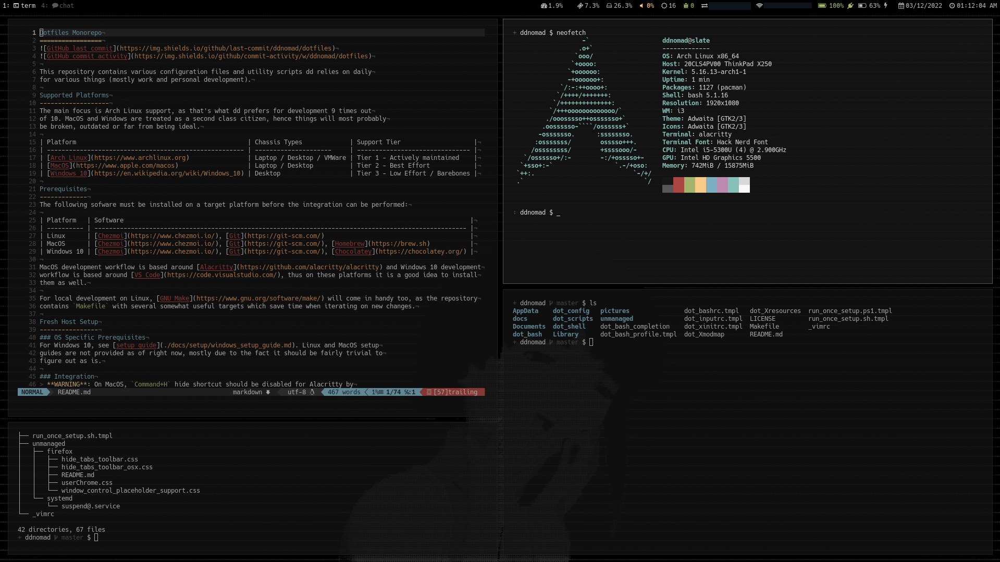

Dotfiles Monorepo
=================


This repository contains various configuration files and utility scripts dd relies on daily for various things (mostly work, [leisure](https://raw.githubusercontent.com/ddnomad/dotfiles/main/.github/leisure.jpg) and pet projects).

Screenshots
-----------


Supported Platforms
-------------------
~~The main focus is Arch Linux support, as that's what dd prefers for development 9 times out of 10. MacOS and Windows are treated as a second class citizen, hence things will most probably be broken, outdated or far from being ideal.~~

The main focus is now shifted to MacOS, as Apple Silicon Macs are too good to ignore. Arch Linux support is still in place and will be maintained long-term, albeit without much in terms of planned changes / improvements.

| Platform                                               | Chassis Types             | Desktop Environments | Support Tier                    |
| ------------------------------------------------------ | ------------------------- | -------------------- | ------------------------------- |
| [MacOS](https://www.apple.com/macos)                   | Laptop / Desktop          | Aqua                 | Tier 1 - Actively Maintained    |
| [Arch Linux](https://www.archlinux.org)                | Laptop / Desktop / VMWare | i3wm / KDE Plasma    | Tier 2 - Best Effort            |
| [Windows 10](https://en.wikipedia.org/wiki/Windows_10) | Desktop                   | Windows Shell        | Tier 3 - Low Effort / Barebones |

Prerequisites
-------------
The following sofware must be installed on a target platform before the integration should be performed:

| Platform   | Software                                                                                                                              |
| ---------- | ------------------------------------------------------------------------------------------------------------------------------------- |
| Linux      | [Chezmoi](https://www.chezmoi.io/), [Git](https://git-scm.com/)                                                                       |
| MacOS      | [Chezmoi](https://www.chezmoi.io/), [Git](https://git-scm.com/), [Homebrew](https://brew.sh)                                          |
| Windows 10 | [Chezmoi](https://www.chezmoi.io/), [Git](https://git-scm.com/), [Chocolatey](https://chocolatey.org/), [Rust Up](https://rustup.rs/) |

MacOS development workflow is based around [Alacritty](https://github.com/alacritty/alacritty) and Windows 10 development workflow is based around [VS Code](https://code.visualstudio.com/), thus on these platforms it is a good idea to install them as well.

For local development on Linux or MacOS, [Cargo Make](https://sagiegurari.github.io/cargo-make) will come in handy too, as the repository contains `Makefile.toml` with several somewhat useful targets which save time when iterating on new changes.

Fresh Host Setup
----------------
### OS Specific Prerequisites
For Windows 10, see [setup guide](./docs/setup/windows_setup_guide.md). Linux and MacOS setup guides are not provided as of right now, mostly due to the fact it should be fairly trivial to figure out as is.

### Integration
> **WARNING**: On MacOS, `Command+H` hide shortcut should be disabled for Alacritty by setting it to a different (preferably, hard to accidentally trigger) key combination. This can be done from `System Preferences -> Keyboard -> Shortcuts -> App Shortcuts`.

> **WARNING**: On MacOS, `Shell Command: Install 'code' command in PATH command` must be executed from within VS Code to make the CLI `code` command available from in `$PATH` before running initial `cargo make apply` or `chezmoi apply`.

> **WARNING**: On Windows, `run_once_*.ps1` will execute in PowerShell bypassing a default security policy (i.e. `powershell.exe -NoLogo -ExecutionPolicy ByPass -File setup.ps1`).

> **WARNING**: On Windows, reboot is required after initial integration, as VS Build Tools are installed and won't be working untill after the reboot.

Run the following to pull down the dotfiles: 
```
chezmoi init ddnomad --ssh
```

Preview what files will be copied (no changes will be made):
```
chezmoi cd && cargo make dry
```

Apply all changes:
```
chezmoi cd && cargo make apply
```

Please note, that files in `"$(chezmoi cd)"/unmanaged/` directory won't be applied automatically. These should be copied manually as needed, as they fall outside of `"${HOME}"` directory of a current user or just tricky to apply automatically.
